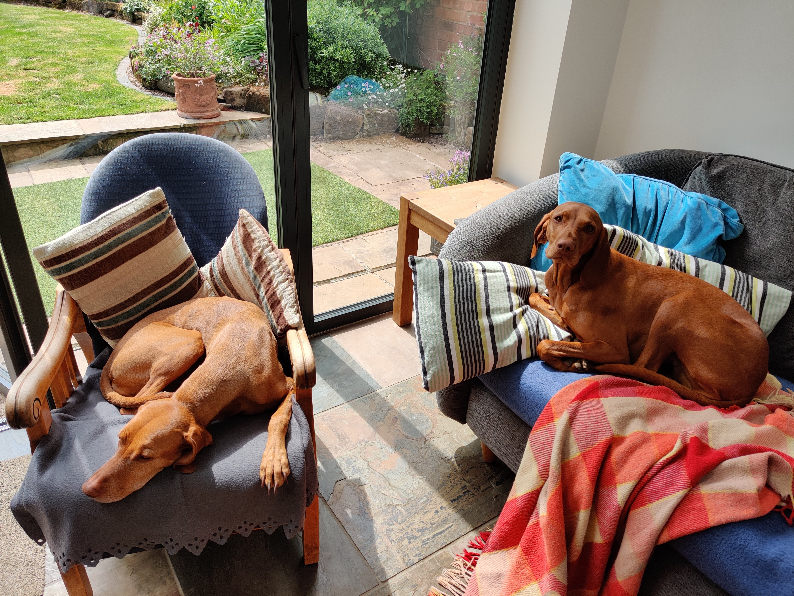
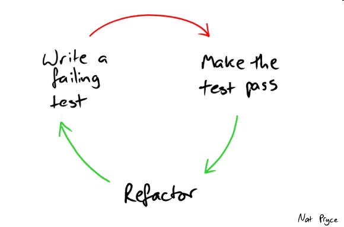

= Code: Who, What, Why, Where, When
Jez Higgins, jez@jezuk.co.uk
{docdate}
:notitle:
:customcss: style/theme-tweak.css
:revealjs_theme: white
:revealjs_progress: false
:revealjs_controls: false

== !

== !

[big]*CODE*

*Who, What, Why, Where, When* +

_Jez Higgins_

ACCU 101: Early Career Day

[NOTE.speaker]
--
Hello again friends, I'm Jez and I'm here to talk with you about code.

* Who it's for
* What it's for
* Why we write it
* Where we should focus our attention
* And honestly, I thought of what seemed like a snappy title, then had to backfill in the abstract to make the title work.

I want us to think about code in the large and in the small, and along the way we'll be addressing the key questions of tabs vs spaces, emacs vs vi, and whether Thor is stronger than the Hulk.

No, of course, we won't, because those things are insoluable and, whisper it, unimportant. There are so many insoluable important things we could be thinking about instead.

If you were to say to me, write us some code, right now, this minute, then sure I can write you some code. And if I said the same to you, could you, all of you here, write some code right now, you'd all say yes, right?
--

== !

[big]*Code is easy*

[NOTE.speaker]
--
Writing code is easy, right?

Yes?

Yes!

Because it's easy, right? We all know how to write code, probably in more than one language, perhaps in quite a few.

But if I did say to you "write me some code", what would you immediately ask of me?
--

== !

[big]*What should I write?*

[NOTE.speaker]
--
Excellent question.

Excellent.

This is the key question that we, all of us here, as professional programmers, all of us in the wider programming community, should be asking.

What should I write?

Because code is hard.
--

== !

[big]*Code is hard*

[NOTE.speaker]
--
When we write code, we taking stuff that we just think up - it comes from inside us  - and communicate that as directly as we can into the computer.  And, after a little bit of practice, that's an easy process.

But the very same things that make writing code easy is what makes writing it hard.

We can imagine what we want, but expressing it code can be difficult. Often the solution to that difficulty feels like it should be writing more code.

If we just do this, then that'll be ok, ah, except February only has 28 days. 29 in an Olympic year, but not 2021 ...

Because code is easy, we can write code all day. And we all know where this is going.
--

== !

[big]*Code is for everyone*

[NOTE.speaker]
--
I've talked so far here about us. What _we_ can imagine, what _we_ can express, what each of us, individually, can imagine and express.

The reality is though, as noted in the _what should I write_ question a moment ago, is that we're not usually engaged in writing software for our own amusement, we're writing for other people, and generally not for their amusement. We're writing it help in their work, or to give them access to some service - maybe book a holiday (perhaps a bad example at the moment), or to inform them they're eligible for a vaccine, or to pay a bill. Or whatever it is - you don't need me to give a list of things we use software for. You're not just programmers, you're normal people too :) You've seen software.

We've already got our own brain-computer barrier we need to cross, but now we have to understand what's in other people's brains too?  Not just the people who will use the software, but the people working with us - the other programmers, the UI designers, maybe video artists. If you have a support desk, what do they need? Are there operations staff that will be looking after it for us?

We have to understand what they want they all want too? And get all that into the software?
--

== !

[big]*Code is easy*

[big]*Code is hard*

[NOTE.speaker]
--
Code is easy, and code is hard, at the same time.

This is the fundamental paradox in the code we write.

We can write reams and reams of it at almost no cost. We can do unimaginable computations in fractions of a second, we chew through vast quantities of data in moments. I'm not talking about things that would astonish our grandparents, I'm taking about capabilities that would amaze ourselves of 10 years ago, five years ago even.

We can do these incredible things, just like that. It's like we have magic in our fingertips. This is ours to command. But the ease with which we can produce that code, can crunch those numbers, that open up these huge possibilities, this vast space we can explore - which is why it's so thrilling - is also why writing code can be so very, very hard.

There's a real tension there, at the very heart of what we do as _software professionals_, as programmers. We have to try and tame that paradox. It's present at all levels, but it's most manifest, most there, down there at the level of the code.

Unfortunately, and this is where I let you down, there is no trick. We aren't cutting the Gordian knot. The magic eye picture isn't going to suddenly resolve. The Mobius strip is not going untwist into a nice little loop.

--

== !

[big]*There are no rules*

[NOTE.speaker]
--
There are no rules we can follow.

If there were, then software would be straightforward, everyone would be doing just fine, and none of us would have gathered here today.

This might sound like a counsel of despair. No rules? Then surely in the grim dark future there is only war? (And, honestly, some of the stories you hear might lead you to this conclusion.) While there may not be rules, we can apply some guidelines, some heuristics, some practices, patterns.

I've already suggested that we have these difference forces in play, and that we're going to be engaged in some kind of a balancing act between, well not good and evil exactly, or even between law and chaos, but between everyone with an interest in the code.

Consequently, there's a tension between these guidelines, and actually within the guidelines themselves. And because they're not rules, there's no single right way to apply them. We have to find out, keep on finding out, what works for each of us, in our context. Actually this is true not just in this session, but I suspect we'll see it again and again throughout the day.

Ok, let's get going
--

== !

[big]*_The code is not the important thing_*

[NOTE.speaker]
--
The people who use our software are deeply, deeply uninterested in our code. They interested in what the code does and, generally speaking for the kind of commercial software most of us are engaged in, how it makes their life easier. They are interested in, and I hate to use such a management sounding word, but it's true, in _outcomes_, and we should be too.

This is an extreme example, but I did a bit of work for a student at the university where I was working. He later told me I'd saved him 9 months of hand calculation, which meant he could submit his PhD thesis earlier than he'd ever expected. He subsequently got a research position in Hawaii and lived in a tropical paradise for the next twenty years. We can, quite genuinely change lives with an afternoon of nudging round a few Excel formulas.

As a more everyday example is the work some of my colleagues at the Ministry of Justice are doing, on preparing the court lists - the trials that are going to take place that day. The service they're in the process of deploying at the moment looks to be reducing the time it takes court staff to prepare for around 90 minutes to about 20 minutes. Now for the people who do that work, who is should be noted are generally overworked as it is, that's great. Maybe they can knock off a bit earlier - I hope so. But it also means the trials are more likely to go ahead, which is beneficial not only for perpetrators and victims of crime, but for society as whole. Does society care that some of the code is written in JavaScript using the GovUK widgets, or that the backend is written in Kotlin with Spring Boot, and the whole thing is deployed into the MoJ Cloud Platform? No, not a jot. Does we, as a society, care about the administration of the criminal justice system? Yes, I think we do.

Now, not everything is going have such a big impact, potentially such a direct societal impact, but everything we do can reach beyond us and the immediate people who use it, out more widely. This touches on the ethics of the software that we write, but that's a whole different topic.

The code itself, the code we write is not important. If we can achieve that aim by not writing any code, then we should not write any code. We should focus on outcomes, on what people want to do.
--

== !

[big]*_People don't know what they want_*

[NOTE.speaker]
--
The difficulty is that people don't know what they want. They can have ideas, and feelings, and intuitions, and they can be very sure about those ideas and feelings. We can ask all the questions we like, offer all kinds of hypotheticals, hold out all kinds of possibilities, and get very definite opinions.

But those ideas and opinions and feelings will change and evolve, and one of the key things that will provoke that change is delivering our software to them. Sometimes that reaction will be quite negative, _what is this_? Sometimes, of course, it's quite positive, but generally in a qualified way, _this is good, but could it do ..._. Nobody has every delivered a piece of software and people have looked at it and said _yes, this is perfect, your work here is done_.

We shouldn't, by the way, use _they don't know what they want_ as an excuse to cut people out. We need them, we need their expertise, we need their advice, we need their help, we need their cooperation.

The only way to find out the outcomes that people really want is to ask them, build something, show it to them (ideally in a real situation), and then ask them again. For that to be a useful, fulfilling process, we need to do that as quickly as possible, as often as possible.

We probably can't deliver perfect software, but we can try and get closer over time.

How quickly is quickly? That's going to depend. How often is often? That's going to depend too. For my MoJ colleagues I mentioned earlier, quickly initially meant several months. However, now they've actually got stuff out there, we're probably looking at monthly. There are organisational reasons why you can't deliver new software into courts more often than that. This is not an arena where we can move fast and break things. Within the team, the cadence is probably higher, but I think they're out to the court about monthly, and that feels pretty good. I work with a team at West Midlands Fire Service who can turn things around in under a day. The dynamics in each case are rather different, but they're both getting stuff out and being used about as fast as they can.

Clearly, this involves people and processes at lots of different levels and places within their respective organisations, but the key element of their ability to deliver quickly is that their code is in good order. The code we write is the wellspring of the whole process. They write what they need to write now, and they try not anticipate beyond that.

Or, as you might have heard it put ...
--

== !

[big]*_Do the simplest thing that could possibly work_*

[NOTE.speaker]
--
Not _do the simplest thing_. Definitely not _do the simple thing_. Not _that will work_. The _simplest thing that could possibly work_. We can't be sure, we have to find out.

This isn't my phrasing, of course it isn't, this is far too sensible for anything I'd have come up with. This is a deeply, deeply profound insight.

_Do the simplest thing that could possibly work_

It applies at all levels - from the architecture of our system, through the various layers or tiers or slices, to the packages/modules/namespaces, to the classes and functions, right down to the lines we write.

What are examples of the simplest thing? Well, down at the level of the code things like

* using familiar terms - if you're working on scheduling fire safety inspections, call it the fire safety inspection scheduler.
* idiomatic language - what's normal for a language you work in? What does a loop typically look like?
* using the standard library. Chances are that container is going to be just fine.
* making everything readonly/final/const - mutable things are immediately more difficult things
* holding to the single responsibility principle - a piece of code - function/class/module should have single reason to change
* your local vernacular - things like code style - camel case, bracket placement, that kind of thing
* keeping methods and functions short - when you get a few related lines together that form their own little thing - say the two branches of an if, that's a candidate for a new function. If that condition is a little bit complicated - it's this or that, or you're filtering some collection, that kind of thing, that's a candidate
* functions, of course, need names, so as you break out these functions that names you give them help simplify your code - your putting additional information into the source. Naming things can be hard, and it is a skill you can develop, but if you're having particular trouble naming a function, your code is telling you something about itself. Good names are hugely powerful.
--

== !

[big]*_The simplest thing might not be simple_*

[NOTE.speaker]
--
Now the simplest thing might not be simple. And what's simple in one context might be ludicrous in another. These aren't rules, remember, they're practices, guidelines.

So what we're doing probably isn't simple, but we should resist overcomplicating. We should aim to express our understanding, our intentions, as fully we can, in the code. And then stop. Once we go beyond that, we're into speculation. Speculation is estimation, and we all know how meaningful software estimates are.

We should build what we need now, because we don't know - we can't know - what we need to build tomorrow. What we're doing today changes tomorrow, for everybody. The less we do, the simpler we make the code today, the easier it will be to change it tomorrow.
--

== !

[big]*_Software development is change_*

[NOTE.speaker]
--
Software changes. All software - it doesn't matter if we're working on "greenfield" development, or legacyist of legacy software - is about change.

The code we write will need changing. We will always be working with incomplete information, sometime because we've chosen to set something aside, sometimes because we genuinely don't know, sometimes both. Our software will need changing because our understanding of what we're try to do has moved, the information we have at hand has shifted. I mean hopefully we have a better understanding, but it's not a given. We are going to be changing the behaviour the existing code. We might adding new functionality alongside what's already there. We might be taking stuff out. (We probably don't take out as much as we should.)

We should be prepared to change, to modify, and adapt, and discard our previous work. It isn't a reflection on us, that the code no longer fits with the work we're trying to do. We are not our code, the code is not us. It isn't our code. It's code we wrote, but it isn't ours.

That can be quite difficult to accept, and I would encourage you, strongly encourage you, to try to cultivate that attitude, that acceptance within yourself, to learn that humility, and to be tolerant of those that might find a little more difficult.

All change is scary. Even if you think you know where you're going, it's still a step into the unknown. In the context of software development, the best advice I can give is
--

== !

[big]*_Change one thing at a time_*

[NOTE.speaker]
--
More specifically ...
--

== !

[big]*_Change the design_*

[big]*_or_*

[big]*_Change the functionality_*

[NOTE.speaker]
--
There's some new piece of work you need to do. You look at the code you have, read it through, and perhaps you can start to see where it'll fit in, the parts of the code base it'll touch. But it's not going to drop right. The code needs to be a bit more like this, or like that.

Make it like that, change the design, what we call refactoring the code, and _then_ add the new functionality. Change the design to allow to change the functionality. Once the functionality is in, you'll probably see an opportunity to tighten the design, to do some further refactoring. It might be, probably will be the case, that you need to go back and forth on this a few times. But be clear which type of change you're making - am I improving the design, am I changing functionality.

Make each individual change as small you can. If I'm working in this function, I'm making that change and commit, then maybe making another over here and commit that, another down there and commit that. Having made those three refactoring changes, I can add in my new functionality, commit that. Which enables this little refactoring.

The smaller I can make each change, the more confident I can be about the change. And this is especially the case if I have tests around the code to support me.
--

== !

[big]*_Practice +
Test Driven Development_*

[NOTE.speaker]
--
At the risk of sounding like a grumpy old man, many of the names and phrases we use in software development have become devalued almost to the point of meaningless. (Semantic diffusion apparently.) Continuous Delivery has somehow come to mean using CircleCI to build your Docker images, or DevOps has comes to mean, well, Ops. In many places and too many people Test Driven Development has, sadly, come to mean writing a couple of unit tests before you commit.

By test driven development, I really mean _writing code will tell you what you need to write_.

We've got some new piece of functionality. If we start by imagining it already exists, as if we've already implemented it, and write some code that's going to use it, we will naturally start to form the interface to that feature. And because we know what we want it to, the outcomes we want, we can write checks and verifications, _assertions_, on that outcomes. If I put a 5 and 2 in my summing engine, then I expect a 7 out the bottom.

At this point of course, nothings going to work. We haven't, in fact, written it. But now we do that. Actually, we've already designed part of the interface when we wrote that test. This is the driving aspect - how is this code used. We can start to fill out the implementation. When that client code, that test, passes, we know two things - that what we've written works, and that we can now safely make changes to the design of our system.
--

== !

[NOTE.speaker]
--
This is the red-green-refactor cycle or, more accessibly, write a failing test, make the test pass, refactor

This is Nat Pryce's picture from his book with Steve Freeman, Growing Object-Oriented Software Guided By Tests, or GOOS

Test itself is an overloaded term - it can mean an exam, or a throat swab, or oh more salt - but in this red phase, we're building a scaffold or jig around our code. In the green phase, we're implementing whatever our new functionality is. In the refactor, we can now reconcile those changes, improve the design - perhaps there's some commonality we can pull out, or some control flow we can simplify now. And we can do that with confidence, because we have that scaffolding.

Again, this can be happening on multiple levels. We might have loops within loops - something system level here, and within that smaller, more focussed scaffolding as we build a particular details.

Now it might have sounded like after banging on for half an hour about not doing things, I'm suddenly telling you write more code. I both am, and am not. We don't spend that much time actually programming. We spend a lot of our not actually writing code at all. We spend a lot of time understanding it - scanning through, and detailed reading - and we spend a lot of time running the code - either to understand the existing behaviour, or to verify that the change we've just made does what we think it should.

With TDD, over time, we end up with two related codebases - we normally think of coupling as bad, but not in this case, because they will evolve together - the code we're actually going to ship, and a scaffold, around that. One the one side the implementation, and on the other we've got examples of how to use it. And that will save us time on understanding, and save time we spend just trying things out, so we actually spend more of time programming, which is the most fun part.

I've talked a lot about making other people's lives better through our software, and that one of the ways we can do that is by delivering software rapidly, listening to reaction, and then changing and redelivering.

TDD is that same cycle, but for us. But instead of delivering every couple of months, or couple of weeks, or even daily, we deliver, _to ourselves_, every few minutes.  And when you're doing that, it's just the most freeing thing, and those possibilities just open up. That landscape just opens up - you want to go there, ok let's go, rather than _oh, you want to go there? right, erm, hang on ..._
--

== !

[big]*_Be the tortoise_*

[NOTE.speaker]
--
Throughout this session, I've emphasised simplicity, working small, making small changes, as we go round a TDD loop making small deliveries, tiny deliveries, putting off thinking about what not useful now for another time, not trying to anticipate the future.

The human brain is an immensely complex structure, the most complex of all known living structures. Even when we use the full range of our cognitive abilities, our brains have limits - quite clear and measurable limits. And we aren't machines - we tire, and we worry, and we have distractions, and concerns, and feelings. Smaller scope, smaller steps, fewer things to juggle, reduces our cognitive load. It's easier to reason about. It's less tiring. Combine that with the little jolt of red/green/refactor, red/green/refactor and not only will you do better work, you will feel better for it.

I want to touch on one last thing before I finish. A lot of what I've talked about has explicitly or implicitly implied that we're all working in one unified team, in an organisation with clear priorities, engaged users and all that. I understand, believe me I understand, that this is not the case for all of us. Or perhaps any of us. However, these practices that I've talked, you can apply them as an individual. You can't leap from nothing into _boompf_ our whole code base now has a wonderful test scaffolding, but you can aim to do the simplest thing. You can apply TDD, perhaps initially with a little leaf class, something like that. You can observe your own behaviour - am I improving the design, am I changing the functionality - and try to regulate it. Don't be too hard on yourself - we're none of us paragons, and I'd be a liar if I said I worked like this all day every day. But I try, and when things aren't going well, I try harder - I slow down, I take smaller steps, and it generally comes right again.

As you experiment with thses practices, as you become more comfortable with them, you will see, and you will feel, their benefits. You will be a better, and happier, programmer.

Thank you for your time, thank you for your attention.
--
